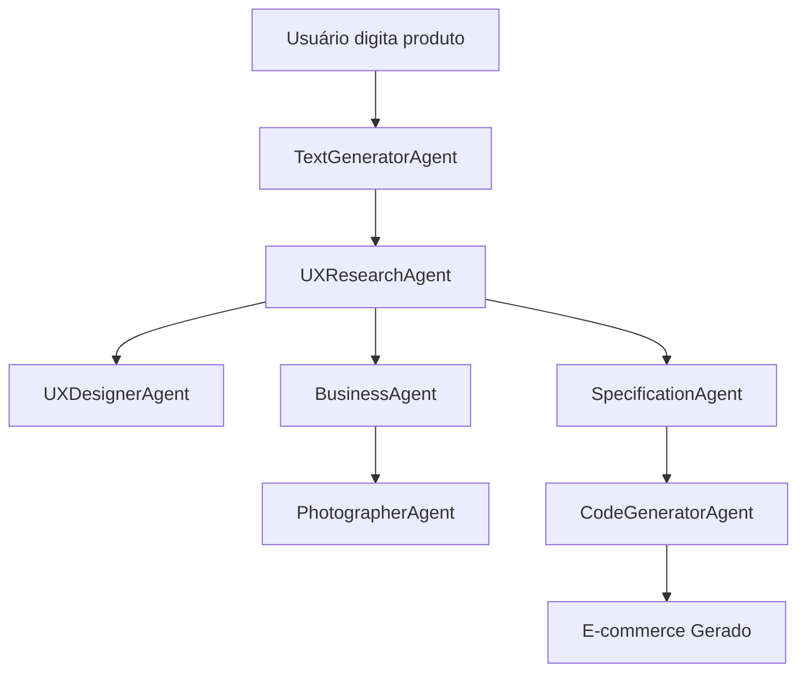

# 🛍️ Gerador de E‑commerce com Multiagentes e IA

> Um gerador inteligente de páginas de e‑commerce que usa um sistema multiagente baseado em IA para criar lojas virtuais completas e personalizadas automaticamente a partir de um simples nome de produto.

---

## 📋 Índice

* [Sobre o Projeto](#-sobre-o-projeto)
* [Funcionalidades](#-funcionalidades)
* [Arquitetura dos Agentes](#-arquitetura-dos-agentes)
* [Pré‑requisitos](#-pré-requisitos)
* [Instalação](#-instalação)
* [Configuração](#-configuração)
* [Uso](#-uso)
* [Estrutura do Projeto](#-estrutura-do-projeto)
* [Fluxo de Geração](#-fluxo-de-geração)
* [Tecnologias Utilizadas](#-tecnologias-utilizadas)
* [Contribuindo](#-contribuindo)
* [Licença](#-licença)

---

## 🎯 Sobre o Projeto

Este projeto demonstra o poder da IA generativa e de sistemas multiagentes na criação automatizada de e‑commerce. A partir de um nome de produto, o sistema orquestra múltiplos agentes especializados que trabalham em conjunto para:

* Criar **personas detalhadas** de clientes;
* Definir **elementos de UX** otimizados;
* Gerar **catálogo de produtos** relacionados;
* Criar **imagens realistas** dos produtos;
* Desenvolver **especificações técnicas**;
* Gerar **código HTML/CSS** completo e responsivo.

---

## ✨ Funcionalidades

* 🤖 **Sistema Multiagente Inteligente**: 7 agentes especializados trabalhando em pipeline;
* 🎨 **Geração Automática de Design**: interface adaptada ao público‑alvo;
* 🖼️ **Criação de Imagens com IA**: fotos de produtos geradas automaticamente;
* 📱 **Design Responsivo**: otimizado para dispositivos móveis e desktop;
* ⚡ **Geração em Tempo Real**: visualização imediata do resultado;
* 🎯 **Personalização por Persona**: UX ajustada ao cliente ideal.

---

## 🏗️ Arquitetura dos Agentes

O sistema é composto por **7 agentes** que se comunicam via **XML estruturado**:

1. **TextGeneratorAgent** 📝
   **Função:** Gera descrição detalhada do produto
   **Input:** Nome do produto
   **Output:** Contexto enriquecido em XML

2. **UXResearchAgent** 👥
   **Função:** Cria a persona do cliente ideal
   **Input:** Contexto do produto
   **Output:** Persona detalhada (demografia, comportamentos, necessidades)

3. **UXDesignerAgent** 🎨
   **Função:** Define elementos visuais e de experiência
   **Input:** Persona do cliente
   **Output:** Paleta de cores, tipografia, layout, CTAs

4. **BusinessAgent** 💼
   **Função:** Cria catálogo de produtos (máx. 3 itens)
   **Input:** Persona do cliente
   **Output:** Lista de produtos com nome, descrição e preço

5. **PhotographerAgent** 📸
   **Função:** Gera imagens realistas dos produtos
   **Input:** Lista de produtos
   **Output:** URLs/arquivos de imagens salvos localmente

6. **SpecificationAgent** 📋
   **Função:** Cria especificação técnica completa
   **Input:** Persona, elementos de UX e imagens
   **Output:** Documento técnico detalhado para desenvolvimento

7. **CodeGeneratorAgent** 💻
   **Função:** Gera código HTML/CSS completo
   **Input:** Especificação técnica e recursos
   **Output:** Código pronto para produção

---

## 📦 Pré‑requisitos

* **Python 3.8+**
* **Conta na OpenAI** com **API Key** ativa
* **pip** (gerenciador de pacotes Python)

> Dica: crie um **virtualenv** para isolar as dependências do projeto.

---

## 🚀 Instalação

```bash
# Clone o repositório
git clone https://github.com/seu-usuario/ecommerce-multiagente-ia.git
cd ecommerce-multiagente-ia

# Crie um ambiente virtual
python -m venv venv

# Ative o ambiente
# Linux/MacOS
source venv/bin/activate
# Windows (PowerShell)
venv\Scripts\Activate.ps1

# Instale as dependências
pip install -r requirements.txt
```

---

## ⚙️ Configuração

### 1) Variáveis de Ambiente

Crie um arquivo **`.env`** na raiz do projeto com o conteúdo:

```env
OPENAI_API_KEY=sk-sua-chave-api-aqui
```

> ⚠️ **Importante:** Nunca compartilhe sua API key publicamente **nem** faça commit do arquivo `.env`.

### 2) Pastas Necessárias

```bash
mkdir -p templates static/images
```

---

## 💡 Uso

### Inicie o servidor Flask

```bash
python app.py
```

### Acesse a aplicação

* URL: [http://127.0.0.1:5000](http://127.0.0.1:5000)

### Gere seu e‑commerce

1. Digite o nome de um produto (ex.: `Fones de ouvido wireless`);
2. Clique em **Gerar E‑commerce**;
3. Aguarde enquanto os agentes trabalham (≈ **15–30s**);
4. Visualize seu e‑commerce personalizado.

---

## 📁 Estrutura do Projeto

```text
ecommerce-multiagente-ia/
├─ app.py                  # Aplicação Flask principal
├─ chat_agents.py          # Definição/Orquestração dos agentes de IA
├─ requirements.txt        # Dependências do projeto
├─ .env                    # Variáveis de ambiente (não commitar!)
├─ README.md               # Documentação
│
├─ templates/              # Templates Flask (Jinja2)
│  └─ base.html            # Template base para renderização
│
├─ static/                 # Arquivos estáticos
│  ├─ css/                 # Estilos CSS (opcional)
│  ├─ js/                  # JavaScript (opcional)
│  └─ images/              # Imagens geradas pelos agentes
│
└─ venv/                   # Ambiente virtual (não commitar!)
```

> Sugestão de `.gitignore` mínimo: `venv/`, `.env`, `__pycache__/`, `*.pyc`, `static/images/*` (se as imagens forem geradas em build).

---

## 🔄 Fluxo de Geração



**Passo a passo:**

1. **Input do Usuário:** nome do produto a ser vendido;
2. **Contexto:** geração de descrição detalhada do produto;
3. **Pesquisa UX:** criação da persona do cliente ideal;
4. **Design UX:** definição de elementos visuais e de experiência;
5. **Catálogo:** lista de produtos relacionados (máx. 3);
6. **Fotografia:** geração de imagens realistas com IA;
7. **Especificação:** documento técnico completo;
8. **Código:** HTML/CSS responsivo;
9. **Resultado:** e‑commerce pronto e funcional.

---

## 🛠️ Tecnologias Utilizadas

**Backend**

* Flask — framework web
* Pydantic — validação de dados
* Pydantic AI — framework para agentes de IA

**IA e ML**

* OpenAI API — GPT‑4 (texto) e DALL·E (imagens)

**Frontend**

* HTML5, CSS3
* Design responsivo (mobile‑first)
* Gradientes e animações CSS

---

## 🤝 Contribuindo

Contribuições são muito bem‑vindas! Siga os passos:

```bash
# 1) Faça um fork do repositório
# 2) Crie uma branch para sua feature
git checkout -b feature/minha-feature
# 3) Faça commits descritivos
git commit -m "feat: adiciona minha feature"
# 4) Envie sua branch
git push origin feature/minha-feature
# 5) Abra um Pull Request
```

**Ideias de evolução:**

* Adicionar mais modelos de IA (Anthropic Claude, Google Gemini);
* Implementar cache de respostas dos agentes;
* Criar dashboard para gerenciar e‑commerces gerados;
* Exportação para plataformas (Shopify, WooCommerce);
* Testes automatizados (PyTest);
* Suporte a múltiplos idiomas;
* API REST para integração externa.

---

## 📄 Licença

Este projeto está sob a licença **MIT**. Consulte o arquivo `LICENSE` para mais detalhes.

